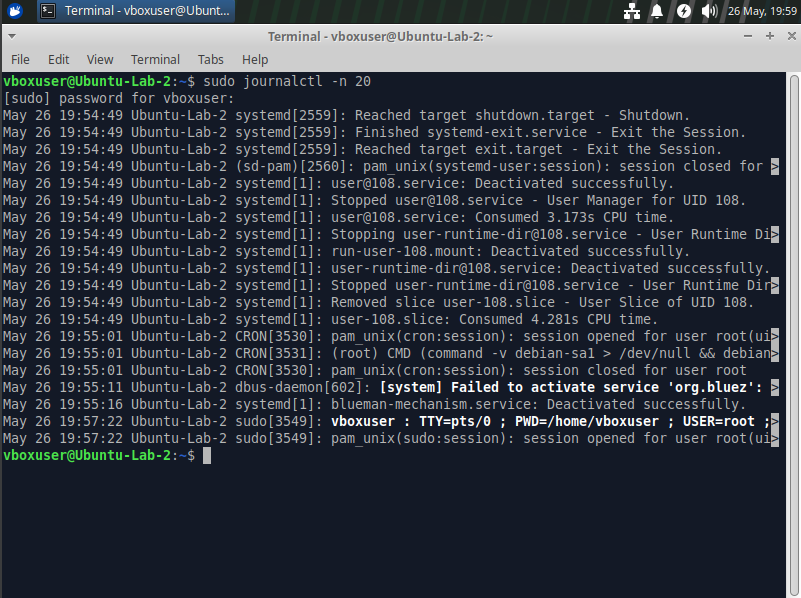
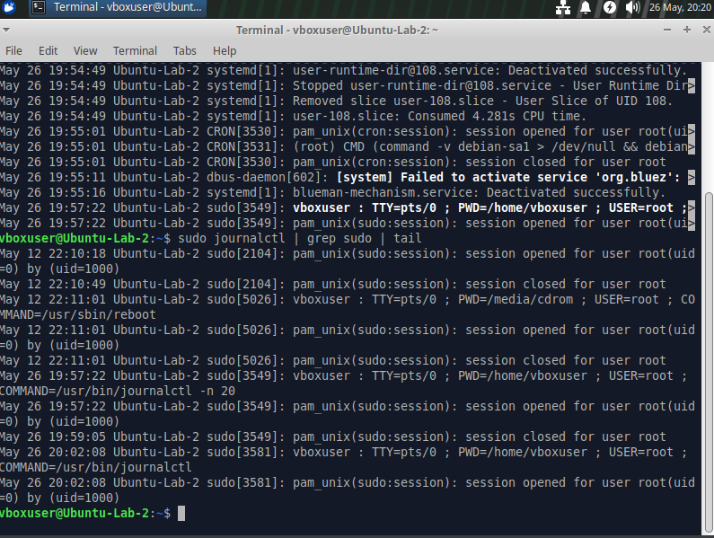
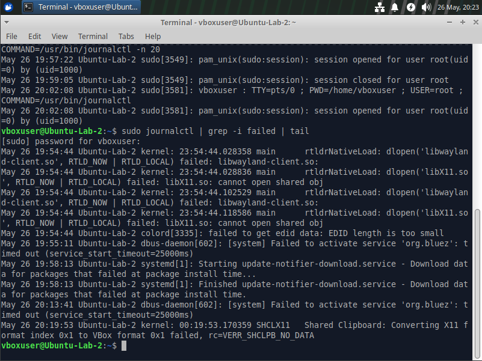
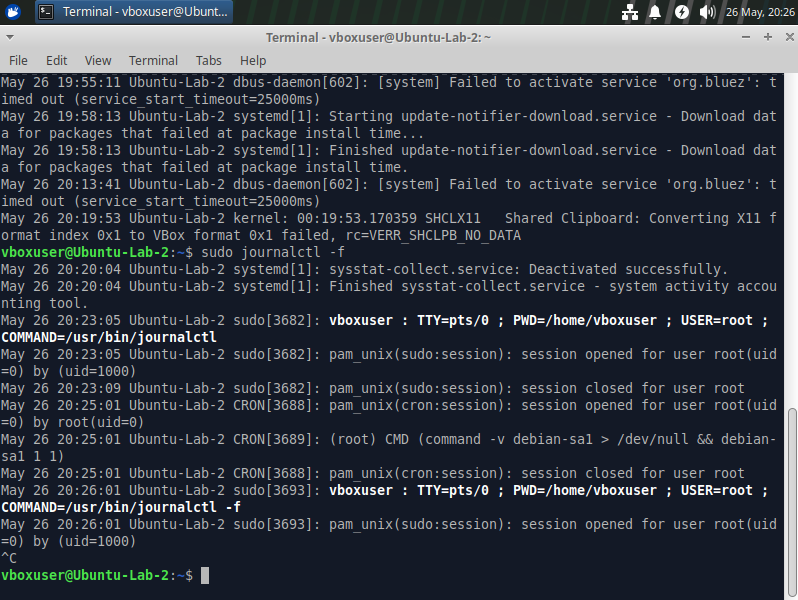

# Linux System Log Analysis Lab

## Objective
Analyze Linux system logs, authentication events, and real-time log activity to better understand operational visibility, security monitoring, and event investigation concepts used in cybersecurity operations.

---

## Lab Overview
In this lab, I explored how Linux systems generate and manage logs related to system activity, authentication events, services, and operational processes. I used journalctl and log filtering techniques to inspect recent logs, review sudo activity, identify failed events, and monitor logs in real time.

---

## Tools Used
- Ubuntu Virtual Machine
- Linux Terminal
- journalctl
- grep
- tail

---

## Steps Performed

### 1. Viewed Recent System Logs

    sudo journalctl -n 20

---

### 2. Reviewed Authentication and Sudo Activity

    sudo journalctl | grep sudo | tail

---

### 3. Filtered Failed Log Events

    sudo journalctl | grep -i failed | tail

---

### 4. Monitored Logs in Real Time

    sudo journalctl -f

---

## Key Findings

- Reviewed recent Linux system log activity and operational events
- Identified sudo authentication and privilege escalation activity
- Observed PAM authentication session logs
- Filtered logs for failed events and service-related issues
- Monitored real-time system activity using live log streaming
- Improved understanding of Linux logging and event visibility

---

## What I Learned

This lab helped me better understand:

- Linux log analysis techniques
- Authentication and sudo auditing
- Event filtering and investigation
- Real-time operational monitoring
- Security visibility concepts
- The importance of logs in cybersecurity investigations

---

## Role Connection

This lab directly relates to cybersecurity operations, SOC analysis, and incident response by demonstrating how Linux logs can be used to investigate authentication activity, monitor system events, identify failures, and improve operational visibility. These concepts are foundational for SIEM platforms, threat hunting, and security monitoring workflows.
